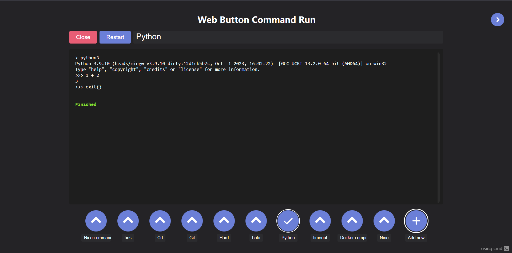

# WebButtonCommandRun
#### [English](README.md) Русский




### Данный проект запускает команды по нажатию кнопки. 😱
Для эмулирования терминала на frontend'е используется библиотека [xterm.js](https://github.com/xtermjs/xterm.js), на backend используется pty 
(на Windows - [go-winpty](https://github.com/iamacarpet/go-winpty), на Unix - [creack/pty](https://github.com/iamacarpet/go-winpty)). Данные передаются по websocket. Go фреймворк - [fiber](https://github.com/gofiber/fiber). 

## Запуск

Скачайте нужный архив с вкладки [релизов](https://github.com/KalashnikovProjects/WebButtonCommandRun/releases) или [соберите](#build) проект сами.

Запустите через бинарный файл, затем откройте в браузере [localhost:8080](localhost:8080).
Порт можно поменять с помощью переменной окружения `PORT` или параметра запуска `-port 8080`.

## CI/CD
При пуше запускаются тесты, линтер и тесты на безопасность (gosec).

При создании релиза запускаются те же тесты, а ещё собираются архивы с исполняемыми файлами для всех систем и прикрепляются к релизу.

Планируется сделать автоматическую доставку релизов на сервер.
## <div id="build">Сборка<div/>

```shell
# Сборка для текущей конфигурации системы
make build-current

# Сборка для всех систем
make build-all

# Сборка под конкретную систему:
make build-windows 
make build-windows32 
make build-linux 
make build-linux-arm 
make build-linux32 
make build-macos 
make build-macos-arm

# По умолчанию собранные файлы отправляются в /binaries.
# Можно настроить с помощью переменной BUILD_PATH: 
make BINARIES_PATH=. build-current
```

## Запуск тестов

Есть тесты для [internal/json_storage](internal/json_storage/json_storage_test.go) и [internal/usecases/console.go](internal/usecases/console_test.go)
```shell
make test
make test-race
make test-coverage
make lint  # golangci-lint run
```


## TODO:
* server mode с паролями и заморозкой конфигов
* возможность заливать .sh или .cmd файлы вместо команды (дополнить структуру команды):
```go
UseFile  bool   `json:"use-file"`
FileText string `json:"file-text"`
```
