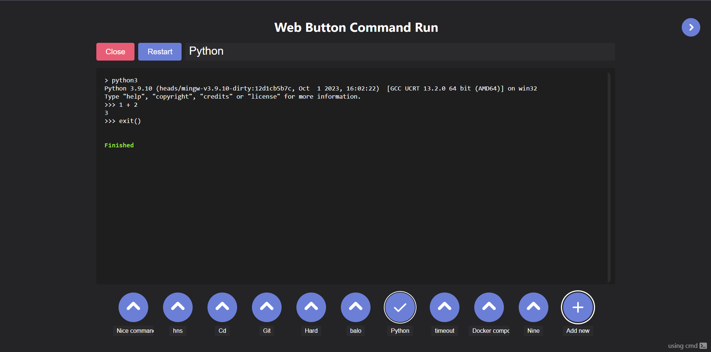

# WebButtonCommandRun

#### English [Русский](README-RU.md)




### This project runs commands when you press a button. 😱
For terminal emulation on the frontend using [xterm.js](https://github.com/xtermjs/xterm.js), on the backend using pty
(Windows - [go-winpty](https://github.com/iamacarpet/go-winpty), Unix - [creack/pty](https://github.com/creack/pty)). Data is transferred via websocket. Go framework - [fiber](https://github.com/gofiber/fiber).

## Launch

Download the appropriate archive from the [releases](https://github.com/KalashnikovProjects/WebButtonCommandRun/releases) tab or [build](#build) the project locally.

Run the binary file, then open [localhost:8080](localhost:8080) in your browser.
You can configure the port with the environment variable `PORT` or with the console parameter `-port 8080`.

## CI/CD
On push, it runs tests, linter and security tests (gosec).

On release, the same tests are run and archives with executable files for all systems are collected and attached to the release.

Automatic release delivery to server is planned.
## <div id="build">Build</div>

```shell
# Build for current configuration
make build-current

# Build for all systems
make build-all

# Build for one system:
make build-windows 
make build-windows32 
make build-linux 
make build-linux-arm 
make build-linux32 
make build-macos 
make build-macos-arm

# By default binaries are built to the /binaries path.
# This can be configured with BINARIES_PATH: 
make BINARIES_PATH=. build-current
```

## Tests

There are tests for [internal/json_storage](internal/json_storage/json_storage_test.go) and [internal/usecases/console.go](internal/usecases/console_test.go)
```shell
make test
make test-race
make test-coverage
make lint  # golangci-lint run
```


## TODO:
* server mode with passwords and config edit locking
* the ability to upload .sh or .cmd files instead of commands (to complement the command structure):
```go
UseFile  bool   `json:"use-file"`
FileText string `json:"file-text"`
```
